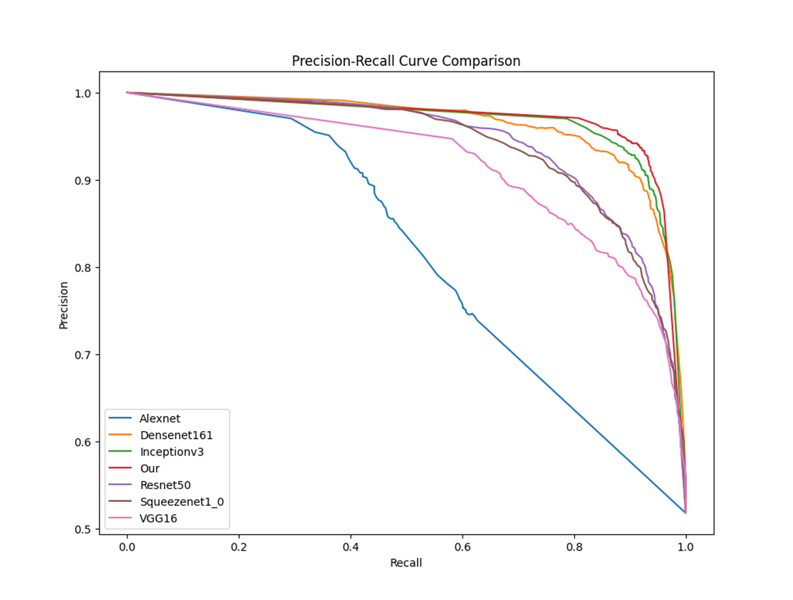

# 多模态特征融合即时社交软件违规图片检测系统

## 系统描述


- 支持对 OCR 后得到的文本进行高效地敏感词检测，可自定义敏感词词库
- 自动找出图片内含有的所有二维码并识别结果，通过正则表达式提取出二维码中所包含的域名，进行域名安全检测
- 对图片进行三分类，根据图片的内容，包括图片特征和文本信息对图片进行分类
- 支持建立图片黑白名单库，并进行匹配

检测流程：

- 我们将原始图片输入模型，先通过inception_v3模型来提取图像特征，同时使用Easy OCR模型提取图片中的文本，之后原始文本输入BERT预训练模型来提取文本特征，将提取到的文本特征和图像特征融合后通过MLP 多层感知机进行分类得到最终的分类结果（此处我们的模型为三分类，包括正常、涉黄和敏感信息三类）
- 使用Easy OCR模型提取到的原始文本信息，将其与铭感词词库中的信息进行比对，得到图像文字铭感词检测结果，其中我们的敏感词检测结果还会进行分类，包括涉政、涉黄以及暴力等
- 识别获取到图片中的二维码，之后提取二维码中的域名信息，之后调用恶意域名检测接口或者使用本地训练的GRU模型进行检测，得到最终的检测结果。
- 从本地图片黑白名单文件夹下自动提取图片特征，建立图片黑白名单向量数据库。将待查询图片的特征在向量数据库中进行最近邻检索，得到最相似的结果。

## 数据评估及结果

如下图所示为8个模型（Our、ERNIE、Inception_v3、Densenet161、Resnet50、Squeeze net_0、VGG16、Alexnet）在准确性、精确度、召回率和F1分数上的对比结果.


| **Model Name** | **Accuracy** | **Precision** | **Recall** | **F1 Score** |
| -------------- | ------------ | ------------- | ---------- | ------------ |
| Our            | 0.9244       | 0.9389        | 0.9136     | 0.926        |
| ERNIE          | 0.6703       | 0.7434        | 0.6703     | 0.6672       |
| Inception_v3   | 0.8775       | 0.8803        | 0.8775     | 0.8757       |
| Densenet161    | 0.8853       | 0.8879        | 0.8853     | 0.8843       |
| Resnet50       | 0.8542       | 0.8568        | 0.8542     | 0.8531       |
| Squeezenet1_0  | 0.8416       | 0.8421        | 0.8416     | 0.841        |
| VGG16          | 0.8069       | 0.8079        | 0.8069     | 0.8023       |
| Alexnet        | 0.6618       | 0.6264        | 0.6618     | 0.5648       |

以下为7个模型（Our、Inception_v3、Densenet161、Resnet50、Squeezenet_0、VGG16、Alexnet）的P-R曲线对比图。



如下图为7个模型（Our、Inception_v3、Densenet161、Resnet50、Squeeze net_0、VGG16、Alexnet）的ROC曲线和对应的AUC面积对比图。


## 代码说明

- `train`目录为训练代码
  - `ocr.py` 为图片 OCR 预处理代码
  - `final_train.py` 为训练代码，`train_log` 为其产生的训练日志
  - `export_onnx.py` 为导出模型为 `onnx` 脚本
  - `val.py` 为验证代码
- `docker`目录为镜像 `build` 工作文件夹，内含推理 `API` 代码及所有模型
  - `onnx_run.py` 为推理 `API` 代码
  - `final_model_v2.onnx` 为多模态特征融合分类模型
  - `Resnet18_search.onnx` 为图片检索特征提取模型
  - `easyocr` 为 `OCR` 相关模型
- `deploy` 目录为部署文件夹，内含 `QQ API` 接入脚本
  - `.conf.json` 为 `QQ API` 配置文件
  - `main.py` 为  `QQ API` 接入程序
  - `result.json` 为模型推理返回结果样例
  - `start.bat` 为 `docker` 启动容器参考命令

## 使用说明

可直接使用 `Docker` 环境运行此系统，如果需直接运行可参考 `docker/Dockerfile` 文件配置环境。

如需构建镜像，请先从 `Releases` 中下载 `model_main.onnx` 与 `model_search.onnx` 模型文件到 `docker` 目录，在 `docker` 目录下执行 `docker build -t image_violation_detection .`。

### 接口说明

API `POST /check_img`

#### 请求参数

`base64` 与 `url` 参数二选一，分别表示图片的 `base64` 编码和图片的 `url` 地址，推荐使用 `base64`，从 `url` 抓取图片可能失败。

#### 返回参数

- `img`： 图片编号
- `white_result`： 白名单检测结果
- `black_result`： 黑名单检测结果
- `imgclass_result`：正常、涉黄、敏感图片的预测概率
- `malicious_detect`: 二维码检测结果
- `sensitive_detect`: 敏感词检测结果
- `ocr_result`: OCR 识别结果

#### 返回样例

```json
{
    "code": 0,
    "data": {
        "img": "tmp/41d96af188e8640fe730bd2aebb344dd",
        "white_result":  {"filename": "a.png", "sim": 0.96},
        "black_result":  {"filename": "b.png", "sim": 0.52},
        "imgclass_result": [
            {
                "label": "normal",
                "prob": 0.9997885823249817
            },
            {
                "label": "porn",
                "prob": 0.00018990205717273057
            },
            {
                "label": "sensitive",
                "prob": 2.1459745767060667e-05
            }
        ],
        "malicious_detect": [
            {
                "Wording": "该网站发布了违反国家相关法律规定的内容，已为您拦截。",
                "WordingTitle": "网站含有违规内容",
                "code": 201,
                "detect_time": "2023-04-14 16:41:02",
                "msg": "域名拦截",
                "url": "https://aaa.com"
            }
        ],
        "ocr_result": "测试",
        "sensitive_detect": {
            "category": "None",
            "keyword": "None"
        }
    },
    "msg": "success"
}
```
### 运行说明

#### 环境变量

- `ocr_type`=`baidu` 或 `easyocr`，表示 OCR 识别方法，`easyocr `则为本地识别，`baidu` 则为调用百度 API 识别，需开通 [通用文字识别 API](https://cloud.baidu.com/product/ocr/general)。若不包含此环境变量则表示不进行 OCR 识别
- `ocr_client_id`=填写百度 API key（仅 OCR 方法为 baidu 时需要）
- `ocr_client_secret`=填写百度 API secret（仅 OCR 方法为 baidu 时需要）
- `sensitive_detect_type`=`remote`/`local`，表示敏感词检测方法，是本地词库匹配还是调用 API，若不设置此环境变量则不进行敏感词检测
- `sen_api_key`=仅敏感词检测为 `remote` 需要，请前往 [该网站](https://www.wordscheck.com/) 获取 API key
- `mal_api_key`=二维码域名检测需要，若不设置此环境变量则不进行二维码域名检测，请前往 [该网站](https://api.ooomn.com/doc/qqsafe.html) 获取 API key
- `knn_query_k`=黑白名单最大返回个数，若不设置默认为 $1$，最大不超过 $50$

#### 运行命令

`docker run --env-file env.list -p 5500:5500 --name image_violation_detection -v img_data:/app/img_data --restart=always tuxiaobei/image_violation_detection`

`env.list` 即为环境变量列表，格式为
```
key1=value1
key2=value2
...
```
宿主机 `img_data` 目录即存储黑白名单图片，其中 `img_data/white` 下存储白名单图片，其中 `img_data/black` 下存储白名单图片